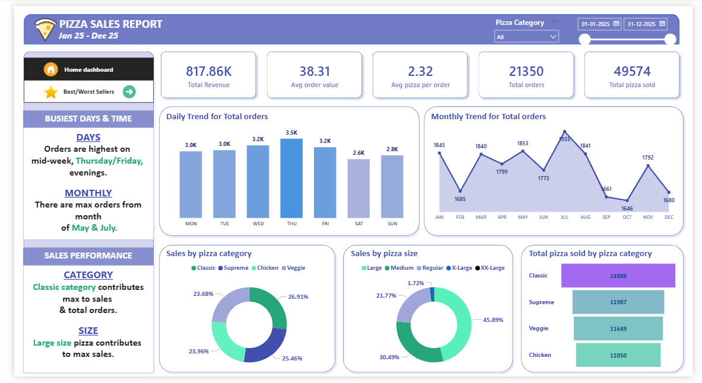

# Pizza Sales Dashboard | Power BI + SQL

# Overview
## Overview
Interactive Pizza Sales Dashboard built using Power BI and SQL to analyze sales performance, order trends, category insights, and top/bottom performing pizzas.

# Tools Used
- Power BI
- SQL
- CSV Dataset
- Data Visualization

# KPIs
- Total Revenue
- Average Order Value
- Total Orders
- Total Pizza Sold
- Average Pizza Per Order

# Analysis
- Daily Order Trend
- Monthly Trend
- Sales by Category
- Sales by Pizza Size
- Top & Bottom Performing Pizzas

## Files Included
- Sales Dashboard.pbix
- pizza_sales.csv
- PIZZA SALES SQL QUERIES.txt

# Dashboard Preview

